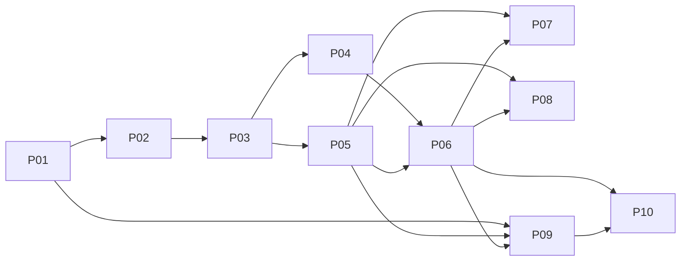

# Continuum｜MVP 开发 Tickets v0.1

**上游规格**：`Continuum-MVP技术规格-v1.0.0`  
**拆分原则**：Tracer-bullet / Vertical Slice

---

## 1. Ticket 拆分原则

每个 Ticket 必须：

- 能形成一个可运行、可验证的纵向能力；
- 跨必要的 Domain / Application / Port / Adapter 层；
- 有明确的验收 Journey；
- 不以“实现某一层”为目标；
- 不在 Ticket 内重新做架构设计。

如果实现中发现 Architecture Gap：

```text
STOP
→ 更新 ADR / Spec
→ 再调整 Ticket
```

禁止：

```text
发现架构问题
→ 临时补一堆实现 Ticket
```

---

## 2. Ticket 总览

| ID | 名称 | 核心产出 |
|---|---|---|
| P01 | 项目初始化与可移植状态闭环 | `init → status → clone → status` |
| P02 | Change 与 Artifact Graph 闭环 | Change / ArtifactRef / Relation 可用 |
| P03 | Work Binding 与跨 Session 连续性 | Work Baseline + Worktree Binding |
| P04 | Matt Artifact 接入与最小 Context Routing | Spec/Ticket/Context/ADR 路由 |
| P05 | Work Reconcile 正确性闭环 | diff/evidence/idempotency/recovery |
| P06 | Change Reconcile 与 Snapshot 推进 | Change close → new Current Snapshot |
| P07 | Codex 原生适配闭环 | Hook + resume + MCP Decision |
| P08 | Oh My Pi 原生适配闭环 | Extension + Widget + Select/Overlay |
| P09 | Doctor、迁移与故障恢复 | schema/runtime/host recovery |
| P10 | Project Archive 闭环 | self-contained archive + final source |

---

## 3. 主依赖图



P04 与 P05 可在 P03 后并行。  
P07 与 P08 可并行。

---

## 4. MVP 最终 Journey

完成 P01～P10 后必须真实跑通：

```text
new repo
→ continuum init
→ open Change
→ Matt Spec / Tickets registered
→ Codex implement P03
→ Work Baseline frozen
→ OMP resumes P03
→ code commit
→ one pending Work Reconcile
→ Change Reconcile
→ Current Snapshot advances
→ fresh Agent resumes project correctly
→ continuum archive
```

---

## 5. 全局完成标准

每个 Ticket 均要求：

- Unit tests；
- Contract / Integration tests（涉及 Port 时）；
- `--json` machine output；
- 错误码符合 Spec；
- 不破坏 Architecture Dependency Rule；
- 不引入未批准的新长期状态；
- 文档只更新与该 Ticket 直接相关的事实。
