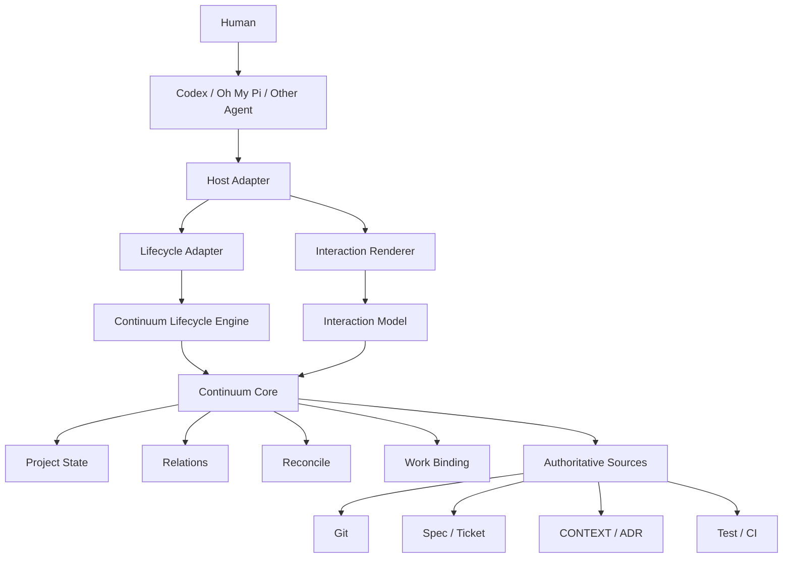

# 02｜系统架构基线

## 1. 总体结构



---

## 2. 核心分层

### Continuum Core

负责：

- Project；
- Snapshot；
- Change；
- ArtifactRef；
- Relation；
- Reconcile；
- Work Binding；
- InteractionRequest。

Core 不依赖：

- Codex；
- OMP；
- Claude；
- Matt；
- 特定 GUI / TUI。

---

### Lifecycle Engine

负责：

> **什么时候需要检查 / 收敛。**

它不把 Hook 当事实源。

规则：

> **Lifecycle correctness is state-derived, event-assisted.**

即：

```text
Hook / Extension / Git Event
→ wake-up signal
→ Core 重新读取 Authority
→ 推导真实状态
```

---

### Host Adapter

每个 Agent Adapter 包含两部分：

```text
Lifecycle Adapter
+
Interaction Renderer
```

#### Lifecycle Adapter

将：

- Codex Hook；
- OMP Extension；
- Git Hook；

转换为统一生命周期信号。

#### Interaction Renderer

将统一的：

```text
STATUS
NOTICE
DECISION
BLOCK
```

转换为宿主最自然的 UI。

---

## 3. Durable 与 Ephemeral 必须分离

### Repo Durable State

建议归属：

```text
.continuum/
```

它跟 Git / Repo 一起走。

持有：

- Project Identity；
- Current Snapshot Pointer；
- Immutable Snapshots；
- Changes；
- Relations；
- Change-level Reconcile / Archive metadata。

### Local Runtime State

建议归属：

```text
.continuum-local/
```

默认 gitignored。

持有：

- Session Binding；
- Session Suppression；
- Worktree Binding runtime projection；
- Pending Ticket Reconcile；
- Hook Cursor；
- Temporary Signals。

> **运行态不应污染项目长期知识。**

---

## 4. Repo Native 原则

Continuum 的项目知识必须跟项目本身走。

```text
git clone
→ Continuum 项目认知仍存在
```

因此：

- Project Snapshot 不能只存在本机用户目录；
- Repository Identity 必须稳定；
- Code Baseline = `Repository Identity + Revision`；
- 不使用裸 Commit SHA 作为跨仓库身份。

---

## 5. 并行 Agent / Worktree 原则

不能让每个 Ticket 修改同一个全局可变 State 文件。

否则：

```text
Agent A reconcile
Agent B reconcile
→ state.yaml merge hotspot
```

最终原则：

- Ticket 级过程不推进 Global Snapshot；
- Change Reconcile 才推进 Current；
- 持久化状态尽量 immutable / append-friendly；
- 当前指针只在高层收敛点更新。

---

## 6. 正式产品形态

```text
continuum-core
      ↓
continuum-cli
      ↓
Host Adapters
  ├─ Codex
  ├─ Oh My Pi
  └─ Generic
      ↓
Optional MCP / Skill / Plugin surfaces
```

### CLI

是最底层通用 Primitive：

- 人能调用；
- Agent 能调用；
- CI 能调用；
- Hook 能调用；
- 离线可诊断。

### Skill / Rules

负责：

- 解释 Continuum；
- 教 Agent 什么时候读 Context；
- 解释 Reconcile 结果；
- 作为低能力 Agent 的降级入口。

**不负责关键生命周期正确性。**

### MCP

是可选工具与交互协议，不是 Core，也不是 State Authority。

---

## 7. 核心架构原则

> **No critical project state transition may depend solely on LLM initiative.**

> **Hooks are wake-up signals, not truth.**

> **Worktree owns continuity; Session owns temporary interaction.**

> **Normal project knowledge is durable; runtime coordination is ephemeral.**
