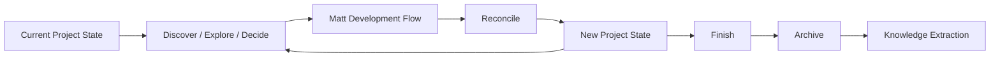

# 03｜生命周期与权威模型

## 1. 项目总生命周期



Matt Development Flow：

```text
CONTEXT / ADR
→ grill / research / prototype / wayfinder
→ to-spec
→ to-tickets
→ TDD / implement
→ code-review
```

---

## 2. 最小领域模型

```text
Project
├── Snapshot
├── Change[]
├── ArtifactRef[]
├── Relation[]
├── Reconcile[]
├── WorkBinding
└── InteractionRequest[]
```

### ArtifactRef

Continuum 不复制 Matt Spec、ADR、Ticket、代码正文。

它保存的是：

> **引用 + 关系 + 当前权威状态。**

---

## 3. Authority Model

| 事实 | 权威来源 |
|---|---|
| 领域概念 / 关系 | `CONTEXT.md` |
| 长期架构决策 | ADR |
| Change 目标 | Spec |
| Work Item | Ticket / Issue Tracker |
| Code | Git |
| Tests | Test Runner / CI |
| 当前全局项目状态 | Continuum Snapshot |
| 跨 Artifact 关系 | Continuum Relation |
| 实现后的收敛证据 | Reconcile |

原则：

> **Continuum 只拥有它应该拥有的事实，不复制其它系统已经拥有的 Authority。**

---

## 4. Change 生命周期

```text
Ad-hoc exploration
↓
正式工作意图
↓
Change Open / Bind
↓
Spec / Tickets
↓
Ticket Implementation
↓
Ticket Reconcile
↓
Change Reconcile
↓
New Snapshot
↓
Close / Archive
```

Continuum 不应在“想法刚出现”时就强迫创建 Change。

应尽可能晚，但早于产生不可逆长期 Artifact。

---

## 5. Work Binding

正式进入某 Ticket 时：

```text
/implement P03
↓
bind worktree → P03
↓
freeze work_start_revision
```

### 为什么需要 Work Baseline

必须区分：

```text
Project Snapshot Baseline
≠
Ticket Work Baseline
```

Ticket Reconcile 应计算：

```text
work_start_revision
→ current_revision
```

而不是：

```text
project_snapshot_revision
→ current_revision
```

否则绑定前的 README、Adapter、其它 Ticket 改动都会被误归到当前 Ticket。

---

## 6. Worktree 与 Session

### Worktree Binding

代表：

> **这个工作树当前正式在做什么。**

是跨 Agent 连续性的基础。

例如：

```text
Codex → P03
关闭 Codex
打开 OMP
→ 自动 resume P03
```

### Session Binding

当前 Session 对 Work 的本地映射。

### Session Suppression

用户说：

> “这次别管 Continuum。”

只 suppress 当前 Session。

不能删除 Worktree Binding。

---

## 7. Ticket Reconcile

Ticket Reconcile 是轻量生命周期过程。

输入：

- Ticket / Spec；
- Work Baseline；
- Current Git Revision；
- Tests；
- Review；
- relevant Context / ADR；
- execution evidence。

输出：

- implementation status；
- changed facts；
- knowledge impact；
- discovered work；
- action class。

### Knowledge Impact

```text
N0 Implementation Only
→ 不产生长期知识 Artifact

N1 Project State
→ 机械状态更新

N2 Domain Change
→ 提议更新 CONTEXT

N3 Architecture Decision
→ 提议 ADR / 需要人决策

N4 Design / Scope Gap
→ STOP，回到设计 / Spec
```

---

## 8. Ticket Reconcile 的持久化

最终冻结：

> **Ticket Reconcile 默认不是长期 Git Artifact。**

普通 N0/N1：

```text
.continuum-local/reconciles/P03.json
```

一个 Ticket 只有一个可更新 Pending Candidate。

多次 commit：

```text
P03 commit 1
P03 commit 2
P03 commit 3
→ 仍更新同一个 P03 Pending Candidate
```

---

## 9. Change Reconcile

Change Reconcile 才是长期收敛边界。

它负责：

- 最终实现 vs Spec；
- 是否更新 CONTEXT；
- 是否产生 ADR；
- 新问题 / 已解决问题；
- Change 是否真正完成；
- Project Stage 是否变化；
- 新 Project Snapshot；
- Archive / supersede 关系。

```text
Ticket Reconcile[]
        ↓
Change Reconcile
        ↓
Immutable Snapshot N+1
        ↓
Current → N+1
```

---

## 10. Reconcile Action Class

### AUTO

机械事实：

- Git revision；
- tests pass；
- close ticket（满足确定条件时）；
- timestamp；
- baseline update。

### PROPOSE

语义知识变化：

- CONTEXT；
- ADR；
- Change scope；
- project knowledge。

### STOP

出现：

- Architecture conflict；
- Design gap；
- Authority conflict。

不得静默重写 Spec / ADR。

---

## 11. Context Routing

默认只读取：

- 当前 Change；
- 当前 Ticket；
- Required Relations；
- relevant CONTEXT；
- relevant ADR。

关系建议使用 Typed Relations：

```text
belongs_to
blocked_by
governed_by
domain_context
evidence
historical
optional
```

默认：

- Required：加载；
- Optional：按需；
- Historical：隐藏。

MVP 不需要为了 Context Routing 引入 RAG / Vector DB / Knowledge Graph。
