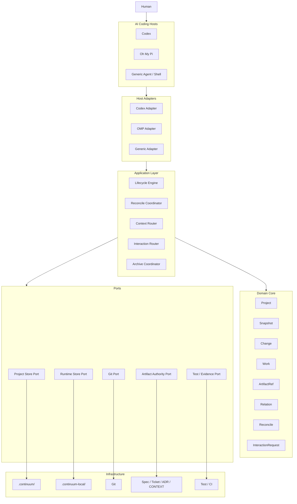

# 01｜总体架构

## 1. 架构定位

Continuum 采用：

> **Local-first、Repo-native、Host-adapted 的 Project Control Plane。**

正式系统由一个独立 Core 和多个宿主 Adapter 组成。

---

## 2. 逻辑架构



---

## 3. 依赖方向

冻结候选：

```text
Host Adapter
      ↓
Application
      ↓
Domain

Infrastructure
      ↑ implements
Ports
```

### 禁止依赖

Domain Core 不得依赖：

- Codex；
- OMP；
- MCP SDK；
- Git CLI；
- 文件系统；
- Matt Pocock Skills；
- SQLite / YAML 实现库；
- UI 框架。

---

## 4. Core 的职责

Core 只维护 Continuum 自己拥有的事实：

- Project Identity；
- Current Snapshot；
- Change Lifecycle；
- Work Boundary；
- ArtifactRef；
- Typed Relation；
- Reconcile Result；
- InteractionRequest / Result。

Core 不拥有：

- Code；
- Spec 正文；
- Ticket 正文；
- ADR 正文；
- CONTEXT 正文；
- 测试结果的原始执行系统。

---

## 5. Application Layer 的职责

### Lifecycle Engine

回答：

> “现在是否到了该检查项目生命周期的时机？”

不直接相信 Hook Payload，而是触发 Authority 重读。

### Reconcile Coordinator

回答：

> “从 Work / Change 的旧状态到现在，发生了什么？”

### Context Router

回答：

> “当前 Agent 为完成这个 Work 最少应该读什么？”

### Interaction Router

回答：

> “这个需要人的状态应该以什么统一语义表达？”

### Archive Coordinator

回答：

> “结束后的项目如何物化成可独立保存的项目知识包？”

---

## 6. Host Adapter 的职责

Host Adapter 只做两件事：

```text
Lifecycle Adapter
+
Interaction Renderer
```

它不拥有业务状态。

例如：

```text
Codex UserPromptSubmit
→ normalized WorkIntent signal

OMP before_agent_start
→ normalized WorkIntent signal
```

最后都进入同一个 Lifecycle Engine。

---

## 7. 架构核心原则

> **Core owns semantics; adapters own host behavior.**

> **Authority is federated; current project state is centralized.**

> **Events wake the system; authoritative state decides the result.**

> **Project knowledge is durable; runtime coordination is local and ephemeral.**
